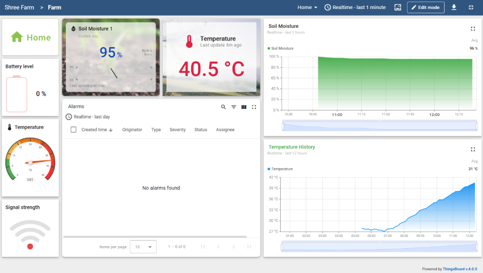

# Smart Soil Moisture Monitoring System – IoT-Based Precision Agriculture

Proudly presenting a **Smart IoT-Based Soil Moisture Monitoring System**, successfully operational for over a year. Designed to enable **precision irrigation**, **optimized water usage**, and **enhanced crop yields**, this system leverages real-time monitoring, automation, and cloud-based analytics for modern sustainable farming.

---

## 🔧 Tech Stack

- **Microcontroller**: ESP32-C6 (low-power Wi-Fi enabled)
- **Sensors**:
  - Corrosion-resistant Resistive Soil Moisture Sensor
  - Waterproof DS18B20 Temperature Sensor
- **Power Supply**: Rechargeable Battery + Solar Panel (for sustainable energy)
- **Cloud Platform**: [ThingsBoard](https://thingsboard.io) – Real-time data visualization & cloud integration
- **Database**: PostgreSQL – Structured data storage & analysis
- **Mobile App**: Android application with real-time alerts and live sensor data

---

## ✨ Key Features

- ✅ **Over-the-Air (OTA) Updates** – Seamless remote firmware upgrades
- ✅ **Robust Error Handling** – Maintains system uptime and reliability
- ✅ **Deep Sleep Mode** – Optimized power consumption for extended battery life
- ✅ **Cloud Integration** – Real-time dashboard with live soil and temperature metrics
- ✅ **Android App Support** – Instant access to environmental data from anywhere
- ✅ **Alarm Notification Alerts** (via mobile + email):
  - 🔸 **Low Soil Moisture** – Prevent plant stress
  - 🔸 **Temperature Anomalies** – Protect crops from extremes
  - 🔸 **Low Battery** – Maintain uninterrupted monitoring
- ✅ **Data Logging & Historical Analysis** – Powered by PostgreSQL for trend-based decision making

---

## 💡 Why Smart Soil Moisture Monitoring Matters

- 💧 **Water Efficiency**: Reduces water usage by up to **30%**
- 🌿 **Plant Health**: Prevents over/under-watering, ensuring optimal growth
- 🧪 **Soil Preservation**: Minimizes nutrient leaching and erosion
- 🕒 **Irrigation Optimization**: Enables data-driven scheduling
- 🌾 **Crop Yield Stability**: Reduces failure risk, supporting food security

---

## 📊 Dashboard Preview

> *(Embed or link your ThingsBoard dashboard screenshot here)*  
> Example:  
> 

---

## 🚀 Getting Started

To deploy this system:

1. **Hardware Setup**:
   - Connect ESP32-C6 with soil moisture and temperature sensors
   - Connect to solar-charged battery system

2. **Firmware Upload**:
   - Flash code with OTA support via Arduino IDE / PlatformIO

3. **Cloud Configuration**:
   - Create ThingsBoard device & configure telemetry
   - Set alarms and thresholds for notifications

4. **Mobile App Setup**:
   - Install the Android application
   - Link to cloud via API key/token

5. **Database**:
   - Setup PostgreSQL server for long-term data logging

---

## 📁 Project Structure

```bash
Smart-Soil-Monitoring/
├── firmware/              # ESP32 firmware code
├── android-app/           # Android source code
├── dashboard-config/      # ThingsBoard JSON configs
├── db-schema/             # PostgreSQL table definitions
├── images/                # Screenshots and diagrams
└── README.md              # This file
